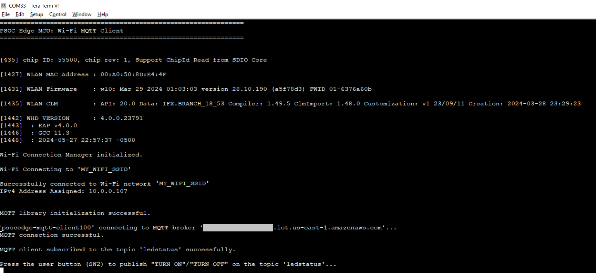

# PSOC&trade; Edge MCU: Wi-Fi MQTT client

This code example demonstrates implementing an MQTT client using the [MQTT library](https://github.com/Infineon/mqtt) on PSOC&trade; Edge MCU. The library uses the AWS IoT device SDK Port library and implements the glue layer that is required for the library to work with Infineon connectivity platforms.

In this example, the MQTT client RTOS task establishes a connection with the configured MQTT broker, and creates two tasks: publisher and subscriber. The publisher task publishes messages on a topic when the user button is pressed on the kit. The subscriber task subscribes to the same topic and controls the user LED1 based on the messages received from the MQTT broker. If the MQTT or Wi-Fi connection is lost, the application will automatically try to reconnect.

**Sequence of operation**

1. The user button is pressed.

2. The GPIO interrupt service routine (ISR) notifies the publisher task.

3. The publisher task publishes a message on a topic.

4. The MQTT broker sends back the message to the MQTT client because it is also subscribed to the same topic.

5. When the message is received, the subscriber task turns the User LED1 ON or OFF. As a result, the user LED toggles every time the user presses the User button1.

This code example has a three project structure - CM33 Secure, CM33 Non-Secure, and CM55 projects. All three projects are programmed to the external QSPI flash and executed in XIP mode. Extended Boot launches the CM33 Secure project from a fixed location in the external flash, which then configures the protection settings and launches the CM33 Non-Secure application. Additionally, CM33 Non-Secure application enables CM55 CPU and launches the CM55 application.

See [Design and Implementation](docs/design_and_implementation.md) for the functional description of this code example. <br>

## Requirements

- [ModusToolbox&trade; software](https://www.infineon.com/modustoolbox) v3.5 or later (tested with v3.5)
- ModusToolbox&trade; PSOC&trade; E84 Early Access Pack. See [Software setup](#software-setup) for more details.
- Board support package (BSP) minimum required version for:
   - KIT_PSE84_EVAL_EPC2: v0.9.5
   - KIT_PSE84_EVAL_EPC4: v0.9.5
- Programming language: C
- Associated parts: All PSOC&trade; Edge E84 MCU parts

## Supported toolchains (make variable 'TOOLCHAIN')

- GNU Arm&reg; embedded compiler v11.3.1 (`GCC_ARM`) - Default value of `TOOLCHAIN`
- Arm&reg; Compiler v6.22 (`ARM`)
- IAR C/C++ Compiler v9.50.2 (`IAR`)
- LLVM Embedded Toolchain for Arm&reg; v19.1.5 (`LLVM_ARM`)

## Supported kits (make variable 'TARGET')

- **PSOC&trade; Edge E84 Evaluation Kit** (Minimum required revision: Rev *D) <br>
   - `KIT_PSE84_EVAL_EPC2` - Default value of `TARGET` <br> 
   - `KIT_PSE84_EVAL_EPC4`

## Hardware setup

This example uses the board's default configuration. See the kit user guide to ensure that the board is configured correctly.

Please ensure below jumper and pin configuration on board.
- Ensure BOOT SW should be in 'High'/ON position. 
- Ensure J20 and J21 should be in Tristate/Not-Connected (NC) position.


## Software setup

See the [ModusToolbox&trade; tools package installation guide](https://www.infineon.com/ModusToolboxInstallguide) for information about installing and configuring the tools package. <br>

<details><summary><b>ModusToolbox&trade; PSOC&trade; Edge E84 Early Access Pack</b></summary>

See _**AN235935** – Getting started with PSOC&trade; Edge E84 MCU on ModusToolbox&trade; software_ for detailed instructions on using the ModusToolbox&trade; Setup Program to install the PSOC&trade; Edge E84 Early Access Pack. A brief overview of the instructions is provided below.
 
1. Download and install the [ModusToolbox&trade; Setup Program](https://softwaretools.infineon.com/tools/com.ifx.tb.tool.modustoolboxsetup)
2. Run the ModusToolbox&trade; Setup Program and log in using your Infineon credentials. 
3. Select the “ModusToolbox&trade; PSOC&trade; Edge E84 Early Access Pack” under additional packages by clicking on the corresponding check box and click on `Next`. 
4. On the next dialog box, the packages which are ready to be installed are listed. You may access the 'Release Notes' and 'License' by clicking on the respective links. You may also choose a custom installation directory for Early Access Pack by clicking on 'Customize Installation'.
    > **Note:** The default installation directory of the Early Access pack is the root "ModusToolbox" installation directory of the respective operating system.<br>
    > **Note:** Do not exceed 120 characters for installation path of Early Access Pack in a non-default
    location in Windows operating system<br>
5. Select the check box to agree to the license and click on `Start`. The ModusToolbox&trade; PSOC&trade; Edge E84 Early Access Pack will be downloaded and installed. 
6. After installing the Early Access Pack, you can use the ModusToolbox&trade; Settings tool to enable the early access environment. The Settings tool (available from ModusToolbox&trade; v3.5 onwards) is a stand-alone tool and can be launched from other ModusToolbox&trade; tools such as Dashboard, BSP Assistant, Project Creator or Library Manager. Alternatively, you may also choose to add the following system variable manually. 
    > Variable name: <code>MTB_ENABLE_EARLY_ACCESS</code> <br>
    Variable value: <code>com.ifx.tb.tool.modustoolboxpackpsoce84</code>
7. Save the Environment variables and restart ModusToolbox&trade; software. 

</details>

Install a terminal emulator if you do not have one. Instructions in this document use [Tera Term](https://teratermproject.github.io/index-en.html).

This example requires no additional software or tools.

## Operation

See [Using the code example](docs/using_the_code_example.md) for instructions on creating a project, opening it in various supported IDEs, and performing tasks such as building, programming, and debugging the application within the respective IDEs.

1. Connect the board to your PC using the provided USB cable through the KitProg3 USB connector.

2. Update the user configuration files based on the following points:

      1. **Wi-Fi configuration:** Set the Wi-Fi credentials in *wifi_config.h*: Modify the macros `WIFI_SSID`, `WIFI_PASSWORD`, and `WIFI_SECURITY` to match with that of the Wi-Fi network that you want to connect.

      2. **MQTT configuration:** Set up the MQTT client and configure the credentials in *mqtt_client_config.h*. Some of the important configuration macros are as follows:

         - `MQTT_BROKER_ADDRESS`: Hostname of the MQTT broker

         - `MQTT_PORT`: Port number to be used for the MQTT connection. As specified by IANA (Internet Assigned Numbers Authority), port numbers assigned for MQTT protocol are *1883* for non-secure connections and *8883* for secure connections. However, MQTT brokers may use other ports. Configure this macro as specified by the MQTT broker.

         - `MQTT_SECURE_CONNECTION`: Set this macro to `1` if a secure (TLS) connection to the MQTT broker is required to be established; else `0`.

         - `MQTT_USERNAME` and `MQTT_PASSWORD`: User name and password for client authentication and authorization, if required by the MQTT broker. However, note that this information is generally not encrypted and the password is sent in plain text. Therefore, this is not a recommended method of client authentication.

         - `CLIENT_CERTIFICATE` and `CLIENT_PRIVATE_KEY`: Certificate and private key of the MQTT client used for client authentication. Note that these macros are applicable only when `MQTT_SECURE_CONNECTION` is set to `1`.

         - `ROOT_CA_CERTIFICATE`: Root CA certificate of the MQTT broker

         See [Setting up the MQTT broker](#setting-up-the-mqtt-broker) to learn how to configure these macros for AWS IoT MQTT broker.

         For a full list of configuration macros used in this code example, see [Wi-Fi and MQTT configuration macros](#wi-fi-and-mqtt-configuration-macros).

      3. Other configuration files: You can optionally modify the configuration macros in the following files according to your application:

         - *core_mqtt_config.h* used by the [MQTT library](https://github.com/Infineon/mqtt).

3. Open a terminal program and select the KitProg3 COM port. Set the serial port parameters to 8N1 and 115200 baud.

4. After programming, the application starts automatically. Observe the application initialization, Wi-Fi connection and MQTT successful connection messages on the UART terminal, and wait for the device to make all the required connections.

   **Figure 1. Application initialization status**

   

5. Once the initialization is complete, confirm that the message *"Press the user button1(SW2) to publish "TURN ON"/"TURN OFF" on the topic 'ledstatus'..."* is printed on the UART terminal. This message may vary depending on the MQTT topic and publish messages that are configured in the *mqtt_client_config.h* file.

6. Press the user button1 (SW2) on the kit to toggle the user LED1 state.

7. Confirm that the user LED1 state is toggled and the messages received on the subscribed topic are printed on the UART terminal.

   **Figure 2. Publisher and subscriber logs**

   

This example can be programmed on multiple kits (*only when `GENERATE_UNIQUE_CLIENT_ID` is set to `1`*); the user LEDs on all the kits will synchronously toggle with button presses on any kit.

Alternatively, the publish and subscribe functionalities of the MQTT client can be individually verified if the MQTT broker supports a test MQTT client like the AWS IoT.

- *To verify the subscribe functionality*: Using the test MQTT client, publish messages such as "TURN ON" and "TURN OFF" on the topic specified by the `MQTT_PUB_TOPIC` macro in *mqtt_client_config.h* to control the LED state on the kit.

- *To verify the publish functionality*: From the Test MQTT client, subscribe to the MQTT topic specified by the `MQTT_SUB_TOPIC` macro and confirm that the messages published by the kit (when the user button is pressed) are displayed on the test MQTT client's console.

**Note:** When the PSOC&trade; Edge E84 Evaluation Kit (EVK) disconnects from a Wi-Fi Router, the application running on the PSOC Edge MCU does not receive the Wi-Fi disconnection event notification. This issue is observed on the EVK (up to Rev *B) having the engineering sample of CYW55513IUBG silicon and is expected to be fixed with the next revision of the EVK. This issue is not observed with Smartphone-based mobile hotspots.

### Configuring the MQTT client

#### Wi-Fi and MQTT configuration macros

 Macro                               |  Description
 :---------------------------------- | :------------------------
 **Wi-Fi Connection Configurations**  |  In *wifi_config.h*
 `WIFI_SSID`       | SSID of the Wi-Fi AP to which the MQTT client connects
 `WIFI_PASSWORD`   | Passkey/password for the Wi-Fi SSID specified above
 `WIFI_SECURITY`   | Security type of the Wi-Fi AP. See `cy_wcm_security_t` structure in *cy_wcm.h* file for details.
 `MAX_WIFI_CONN_RETRIES`   | Maximum number of retries for Wi-Fi connection
 `WIFI_CONN_RETRY_INTERVAL_MS`   | Time interval in milliseconds in between successive Wi-Fi connection retries
 **MQTT Connection Configurations**  |  In *mqtt_client_config.h*
 `MQTT_BROKER_ADDRESS`      | Hostname of the MQTT broker
 `MQTT_PORT`                | Port number to be used for the MQTT connection. As specified by IANA, port numbers assigned for MQTT protocol are *1883* for non-secure connections and *8883* for secure connections. However, MQTT brokers may use other ports. Configure this macro as specified by the MQTT broker.
 `MQTT_SECURE_CONNECTION`   | Set this macro to `1` if a secure (TLS) connection to the MQTT broker is required to be established; else `0`.
 `MQTT_USERNAME` <br> `MQTT_PASSWORD`   | User name and password for client authentication and authorization, if required by the MQTT broker. However, note that this information is generally not encrypted and the password is sent in plain text. Therefore, this is not a recommended method of client authentication.
 **MQTT Client Certificate Configurations**  |  In *mqtt_client_config.h*
 `CLIENT_CERTIFICATE` <br> `CLIENT_PRIVATE_KEY`  | Certificate and private key of the MQTT client used for client authentication. Note that these macros are applicable only when `MQTT_SECURE_CONNECTION` is set to `1`.
 `ROOT_CA_CERTIFICATE`      |  Root CA certificate of the MQTT broker
 **MQTT Message Configurations**    |  In *mqtt_client_config.h*
 `MQTT_PUB_TOPIC`           | MQTT topic to which the messages are published by the Publisher task to the MQTT broker
 `MQTT_SUB_TOPIC`           | MQTT topic to which the subscriber task subscribes to. The MQTT broker sends the messages to the subscriber that are published in this topic (or equivalent topic).
 `MQTT_MESSAGES_QOS`        | The Quality of Service (QoS) level to be used by the publisher and subscriber. Valid choices are `0`, `1`, and `2`.
 `ENABLE_LWT_MESSAGE`       | Set this macro to `1` if you want to use the 'Last Will and Testament (LWT)' option; else `0`. LWT is an MQTT message that will be published by the MQTT broker on the specified topic if the MQTT connection is unexpectedly closed. This configuration is sent to the MQTT broker during MQTT connect operation; the MQTT broker will publish the Will message on the Will topic when it recognizes an unexpected disconnection from the client.
 `MQTT_WILL_TOPIC_NAME` <br> `MQTT_WILL_MESSAGE`   | The MQTT topic and message for the LWT option described above. These configurations are applicable only when `ENABLE_LWT_MESSAGE` is set to `1`.
 `MQTT_DEVICE_ON_MESSAGE` <br> `MQTT_DEVICE_OFF_MESSAGE`  | The MQTT messages that control the device (LED) state in this code example.
 **Other MQTT Client Configurations**    |  In *mqtt_client_config.h*
 `GENERATE_UNIQUE_CLIENT_ID`   | Every active MQTT connection must have a unique client identifier. If this macro is set to `1`, the device will generate a unique client identifier by appending a timestamp to the string specified by the `MQTT_CLIENT_IDENTIFIER` macro. This feature is useful if you are using the same code on multiple kits simultaneously.
 `MQTT_CLIENT_IDENTIFIER`     | The client identifier (client ID) string to be used during MQTT connection. If `GENERATE_UNIQUE_CLIENT_ID` is set to `1`, a timestamp is appended to this macro value and used as the client ID; else, the value specified for this macro is directly used as the client ID.
 `MQTT_CLIENT_IDENTIFIER_MAX_LEN`   | The longest client identifier that an MQTT server must accept (as defined by the MQTT 3.1.1 spec) is 23 characters. However, some MQTT brokers support longer client IDs. Configure this macro as per the MQTT broker specification.
 `MQTT_TIMEOUT_MS`            | Timeout in milliseconds for MQTT operations in this example
 `MQTT_KEEP_ALIVE_SECONDS`    | The keepalive interval in seconds used for MQTT ping request
 `MQTT_ALPN_PROTOCOL_NAME`   | The application layer protocol negotiation (ALPN) protocol name to be used that is supported by the MQTT broker in use. Note that this is an optional macro for most of the use cases. <br>Per IANA, the port numbers assigned for MQTT protocol are 1883 for non-secure connections and 8883 for secure connections. In some cases, there is a need to use other ports for MQTT like port 443 (which is reserved for HTTPS). ALPN is an extension to TLS that allows many protocols to be used over a secure connection.
 `MQTT_SNI_HOSTNAME`   | The server name indication (SNI) host name to be used during the transport layer security (TLS) connection as specified by the MQTT broker. <br>SNI is extension to the TLS protocol. As required by some MQTT brokers, SNI typically includes the hostname in the "Client Hello" message sent during TLS handshake.
 `MQTT_NETWORK_BUFFER_SIZE`   | A network buffer is allocated for sending and receiving MQTT packets over the network. Specify the size of this buffer using this macro. Note that the minimum buffer size is defined by the `CY_MQTT_MIN_NETWORK_BUFFER_SIZE` macro in the MQTT library.
 `MAX_MQTT_CONN_RETRIES`   | Maximum number of retries for MQTT connection
 `MQTT_CONN_RETRY_INTERVAL_MS`   | Time interval in milliseconds in between successive MQTT connection retries

<br>

#### Setting up the MQTT broker

<details><summary><b>AWS IoT MQTT</b></summary>

 1. Set up the MQTT device (also known as a *Thing*) in the AWS IoT core as described in the [Getting started with AWS IoT tutorial](https://docs.aws.amazon.com/iot/latest/developerguide/iot-gs.html).

    **Note:** While setting up your device, ensure that the policy associated with this device permits all MQTT operations (*iot:Connect*, *iot:Publish*, *iot:Receive*, and *iot:Subscribe*) for the resource used by this device. For testing purposes, it is recommended to have the following policy document which allows all *MQTT Policy Actions* on all *Amazon Resource Names (ARNs)*.
    ```
    {
        "Version": "2012-10-17",
        "Statement": [
            {
                "Effect": "Allow",
                "Action": "iot:*",
                "Resource": "*"
            }
        ]
    }
    ```

 2. In the *mqtt_client_config.h* file, set `MQTT_BROKER_ADDRESS` to your custom endpoint on the **Settings** page of the AWS IoT console. This has the format `ABCDEFG1234567.iot.<region>.amazonaws.com`.

 3. Set the macros `MQTT_PORT` to `8883` and `MQTT_SECURE_CONNECTION` to `1` in the *mqtt_client_config.h* file.

 4. Download the following certificates and keys that are created and activated in the previous step:

       - A certificate for the AWS IoT Thing - *xxxxxxxxxx.cert.pem*
       - A public key - *xxxxxxxxxx.public.key*
       - A private key - *xxxxxxxxxx.private.key*
       - Root CA "RSA 2048 bit key: Amazon Root CA 1" for AWS IoT from [CA certificates for server authentication](https://docs.aws.amazon.com/iot/latest/developerguide/server-authentication.html#server-authentication-certs).

 5. Using these certificates and keys, enter the following parameters in *mqtt_client_config.h* in Privacy-Enhanced Mail (PEM) format:
       - `CLIENT_CERTIFICATE` - *xxxxxxxxxx.cert.pem*
       - `CLIENT_PRIVATE_KEY` - *xxxxxxxxxx.private.key*
       - `ROOT_CA_CERTIFICATE` - Root CA certificate

    You can either convert the values to strings manually following the format shown in *mqtt_client_config.h* or you can use the HTML utility available [here](https://github.com/Infineon/amazon-freertos/blob/master/tools/certificate_configuration/PEMfileToCString.html) to convert the certificates and keys from PEM format to C string format. You need to clone the repository from GitHub to use the utility.

</details>

### Wi-Fi Throughput
This code example is configured to run on CM33 core at a frequency of 200 MHz, out of the external flash memory. However, this setup may result in lower throughput compared to running the code in internal memory (SRAM).
For optimal performance, it is recommended to run the code example on CM55 core at 400 MHz, leveraging the internal memory (i.e. System SRAM/SoCMEM). For guidance on achieving better throughput, refer to the README file of the Wi-Fi Bluetooth tester (mtb-psoc-edge-wifi-bluetooth-tester) application.

## Related resources

Resources  | Links
-----------|----------------------------------
Application notes  | **AN235935** – Getting started with PSOC&trade; Edge E84 MCU on ModusToolbox&trade; software <br/> **AN236697** - Getting started with PSOC&trade; MCU and AIROC&trade; Connectivity devices
Code examples  | [Using ModusToolbox&trade; software](https://github.com/Infineon/Code-Examples-for-ModusToolbox-Software) on GitHub 
Device documentation | PSOC&trade; Edge E84 MCU datasheet 
Development kits | Select your kits from the [Evaluation board finder](https://www.infineon.com/cms/en/design-support/finder-selection-tools/product-finder/evaluation-board) page
Libraries  |  **mtb-device-support-pse8xxgp** – Device support library for PSE8XXGP <br /> **retarget-io** – Utility library to retarget STDIO messages to a UART port
Tools  | [ModusToolbox&trade; software](https://www.infineon.com/modustoolbox) – ModusToolbox&trade; software is a collection of easy-to-use software and tools enabling rapid development with Infineon MCUs, covering applications from embedded sense and control to wireless and cloud-connected systems using AIROC&trade; Wi-Fi and Bluetooth&reg; connectivity devices. <br />


## Other resources


Infineon provides a wealth of data at www.infineon.com to help you select the right device, and quickly and effectively integrate it into your design.


## Document history


Document title: *CE239538* - *PSOC&trade; Edge MCU: Wi-Fi MQTT client*

 Version | Description of change
 ------- | ---------------------
 1.0.0   | New code example
 1.1.0   | Updated code example to support ModusToolbox&trade; v3.2 <br> Updated secure project <br> Updated README
 1.2.0   | Updated code example to support ModusToolbox&trade; v3.3 <br> Updated secure project <br> Updated README
 1.3.0   | Updated code example to support ModusToolbox&trade; v3.5 <br> Updated to replace HAL with PDL API and to support libraries updated for the next major version of HAL <br> Added support for Arm&reg; Compiler v6.22,  LLVM Embedded Toolchain for Arm® v19.1.5 and IAR C/C++ Compiler v9.50.2 <br> Updated secure project <br>Updated README<br> Renamed the default supported BSP to `KIT_PSE84_EVAL_EPC2` <br> Added support for new BSP `KIT_PSE84_EVAL_EPC4`

All referenced product or service names and trademarks are the property of their respective owners.

The Bluetooth&reg; word mark and logos are registered trademarks owned by Bluetooth SIG, Inc., and any use of such marks by Infineon is under license.

---------------------------------------------------------

© Cypress Semiconductor Corporation, 2024-2025. This document is the property of Cypress Semiconductor Corporation, an Infineon Technologies company, and its affiliates ("Cypress").  This document, including any software or firmware included or referenced in this document ("Software"), is owned by Cypress under the intellectual property laws and treaties of the United States and other countries worldwide.  Cypress reserves all rights under such laws and treaties and does not, except as specifically stated in this paragraph, grant any license under its patents, copyrights, trademarks, or other intellectual property rights.  If the Software is not accompanied by a license agreement and you do not otherwise have a written agreement with Cypress governing the use of the Software, then Cypress hereby grants you a personal, non-exclusive, nontransferable license (without the right to sublicense) (1) under its copyright rights in the Software (a) for Software provided in source code form, to modify and reproduce the Software solely for use with Cypress hardware products, only internally within your organization, and (b) to distribute the Software in binary code form externally to end users (either directly or indirectly through resellers and distributors), solely for use on Cypress hardware product units, and (2) under those claims of Cypress's patents that are infringed by the Software (as provided by Cypress, unmodified) to make, use, distribute, and import the Software solely for use with Cypress hardware products.  Any other use, reproduction, modification, translation, or compilation of the Software is prohibited.
<br>
TO THE EXTENT PERMITTED BY APPLICABLE LAW, CYPRESS MAKES NO WARRANTY OF ANY KIND, EXPRESS OR IMPLIED, WITH REGARD TO THIS DOCUMENT OR ANY SOFTWARE OR ACCOMPANYING HARDWARE, INCLUDING, BUT NOT LIMITED TO, THE IMPLIED WARRANTIES OF MERCHANTABILITY AND FITNESS FOR A PARTICULAR PURPOSE.  No computing device can be absolutely secure.  Therefore, despite security measures implemented in Cypress hardware or software products, Cypress shall have no liability arising out of any security breach, such as unauthorized access to or use of a Cypress product. CYPRESS DOES NOT REPRESENT, WARRANT, OR GUARANTEE THAT CYPRESS PRODUCTS, OR SYSTEMS CREATED USING CYPRESS PRODUCTS, WILL BE FREE FROM CORRUPTION, ATTACK, VIRUSES, INTERFERENCE, HACKING, DATA LOSS OR THEFT, OR OTHER SECURITY INTRUSION (collectively, "Security Breach").  Cypress disclaims any liability relating to any Security Breach, and you shall and hereby do release Cypress from any claim, damage, or other liability arising from any Security Breach.  In addition, the products described in these materials may contain design defects or errors known as errata which may cause the product to deviate from published specifications. To the extent permitted by applicable law, Cypress reserves the right to make changes to this document without further notice. Cypress does not assume any liability arising out of the application or use of any product or circuit described in this document. Any information provided in this document, including any sample design information or programming code, is provided only for reference purposes.  It is the responsibility of the user of this document to properly design, program, and test the functionality and safety of any application made of this information and any resulting product.  "High-Risk Device" means any device or system whose failure could cause personal injury, death, or property damage.  Examples of High-Risk Devices are weapons, nuclear installations, surgical implants, and other medical devices.  "Critical Component" means any component of a High-Risk Device whose failure to perform can be reasonably expected to cause, directly or indirectly, the failure of the High-Risk Device, or to affect its safety or effectiveness.  Cypress is not liable, in whole or in part, and you shall and hereby do release Cypress from any claim, damage, or other liability arising from any use of a Cypress product as a Critical Component in a High-Risk Device. You shall indemnify and hold Cypress, including its affiliates, and its directors, officers, employees, agents, distributors, and assigns harmless from and against all claims, costs, damages, and expenses, arising out of any claim, including claims for product liability, personal injury or death, or property damage arising from any use of a Cypress product as a Critical Component in a High-Risk Device. Cypress products are not intended or authorized for use as a Critical Component in any High-Risk Device except to the limited extent that (i) Cypress's published data sheet for the product explicitly states Cypress has qualified the product for use in a specific High-Risk Device, or (ii) Cypress has given you advance written authorization to use the product as a Critical Component in the specific High-Risk Device and you have signed a separate indemnification agreement.
<br>
Cypress, the Cypress logo, and combinations thereof, ModusToolbox, PSOC, CAPSENSE, EZ-USB, F-RAM, and TRAVEO are trademarks or registered trademarks of Cypress or a subsidiary of Cypress in the United States or in other countries. For a more complete list of Cypress trademarks, visit www.infineon.com. Other names and brands may be claimed as property of their respective owners.


